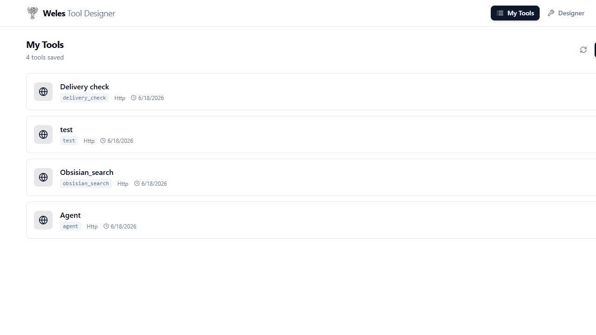
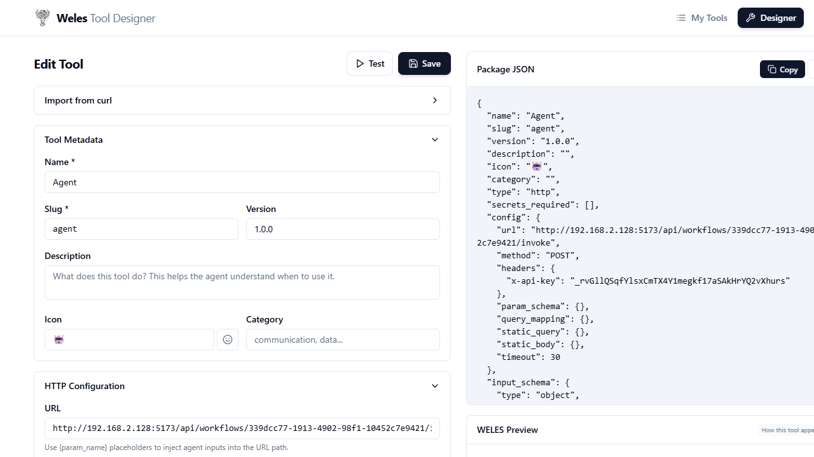
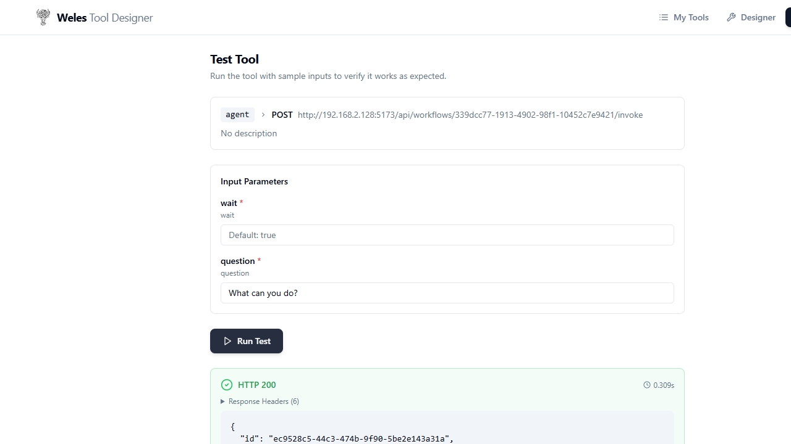
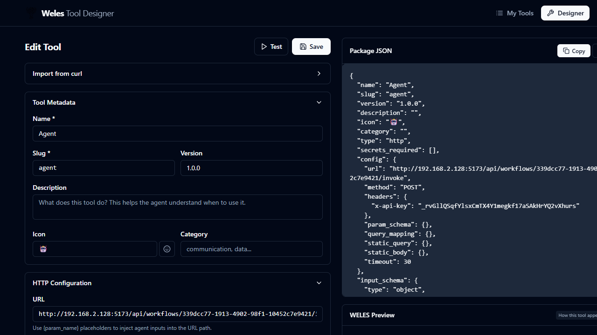

# 🧰 Weles Tool Designer

[](https://github.com/weles-ai-agent/tool-designer)
[](LICENSE)

**Weles Tool Designer** is a **no-code tool builder** for AI agents. Design, manage, and test HTTP-based tools that AI agents can securely invoke — all without writing a single line of glue code.

Built for the [**Weles**](https://welesai.com) platform — a platform for building local AI agents with Intelligent Document Processing (IDP) capabilities at its core.

> 🔗 **Weles** — Move beyond legacy OCR. Weles is a next-generation AI-powered IDP and cognitive AI assistant platform that orchestrates specialized agents to process, analyze, and discuss your most complex documents — with 100% data sovereignty. Visit [welesai.com](https://welesai.com)

---

## ✨ Why Weles Tool Designer?

- 🧩 **No-code tool creation** — define API endpoints, parameters, headers, and data schemas through an intuitive UI. No coding required.
- ⚡ **Instant testing** — execute live HTTP requests directly from the browser with built-in secret management (`{{PLACEHOLDERS}}`).
- 🤖 **AI-agent ready** — every tool you design is immediately consumable by Weles AI agents in automated document processing workflows.
- 🗂️ **Tool library** — browse, edit, clone, and organize all your tool definitions in one place.
- 🌗 **Dark mode** — full light/dark theme support for comfortable use.

---

## 🏗️ Tech Stack

| Layer | Technology |
|-------|-------------|
| Backend | Python 3.12, FastAPI, Pydantic, httpx |
| Frontend | React 18, Vite, TailwindCSS 3 |
| Deployment | Docker, Docker Compose |

---

## 🚀 Getting Started

### Prerequisites

- [Docker](https://docs.docker.com/get-docker/) + Docker Compose
- Node.js 20+ & Python 3.12 (local dev only)

### Production (Docker)

```bash
docker compose up -d
```

App available at **http://localhost:3000**

### Development (hot-reload)

```bash
docker compose -f docker-compose.dev.yml up
```

App available at **http://localhost:3000**

### Local (without Docker)

**Backend:**
```bash
cd backend
pip install -r requirements.txt
uvicorn main:app --reload --port 8000
```

**Frontend:**
```bash
cd frontend
npm install
npm run dev
```

---

## 📁 Project Structure

```
tool-designer/
├── backend/
│   ├── main.py              # FastAPI API + static frontend serving
│   ├── tool_runner.py        # HTTP tool execution engine
│   └── requirements.txt
├── frontend/
│   ├── src/
│   │   ├── App.jsx           # Main React application
│   │   ├── main.jsx          # Entry point
│   │   └── components/
│   │       ├── ToolList.jsx      # Saved tools browser
│   │       ├── ToolDesigner.jsx  # No-code tool editor
│   │       ├── ToolTester.jsx    # Live tool testing panel
│   │       ├── JsonPreview.jsx   # JSON preview
│   │       └── Toast.jsx         # Toast notifications
│   ├── index.html
│   ├── package.json
│   └── vite.config.js
├── Dockerfile                   # Multi-stage build (Node → Python)
├── docker-compose.yml           # Production config
├── docker-compose.dev.yml       # Development config
└── docs/
    └── screenshots/             # App screenshots
```

---

## 📸 Screenshots

| | |
|---|---|
| **Tool Library** | **Tool Designer** |
|  |  |
| **Tool Tester** | **Dark Mode** |
|  |  |

---

## 📄 License

MIT © [Weles](https://welesai.com)
